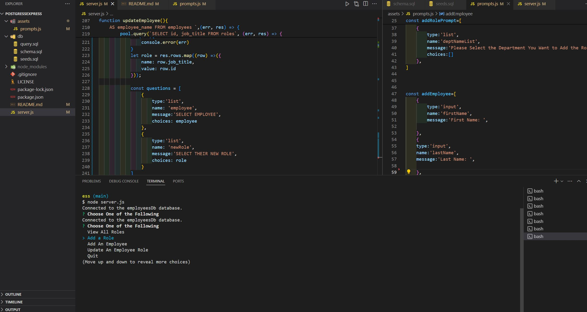

# postgressexpress

## Description
This is a CLI application for keeping track of an employee database. 

## Installation
Install node.js and postgresql to start, then install pg and inquirer via npm.

## Technologies
Javascript
nodeJS
postresql
npm:
inquirer
pg

## Usage
The User needs to enter node server.js to run the application in the terminal. The user is met with several different options and is prompted to select one.  Depending on which option was selected, the user is met with a prompt to enter,update,or view.

## license
See repository for licensing information 

## Credits
Collaborators include: Alicc Madd
resources used: MDN, W3 schools, google search

## links

github repo:
https://github.com/RTAKA808/postgressexpress

screenshot:
